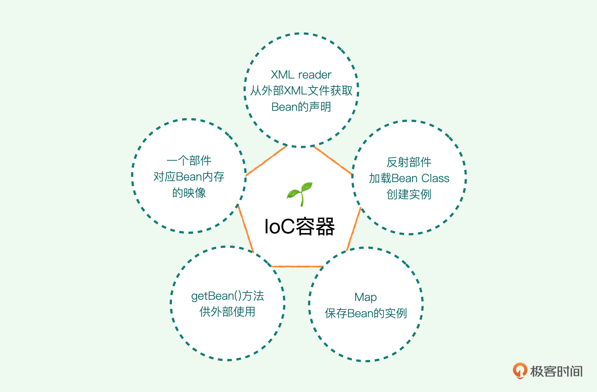
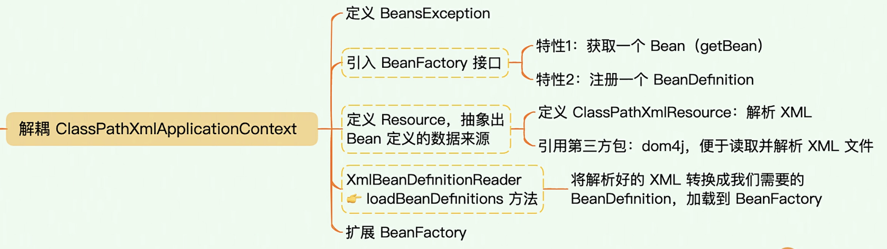
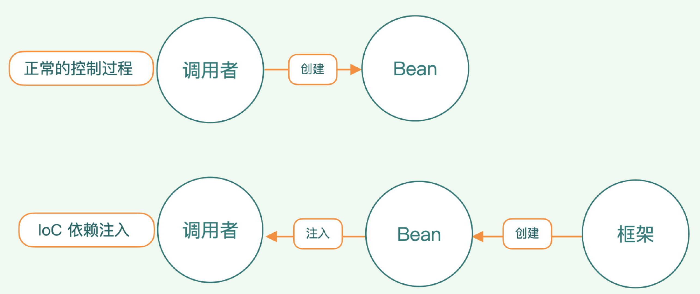
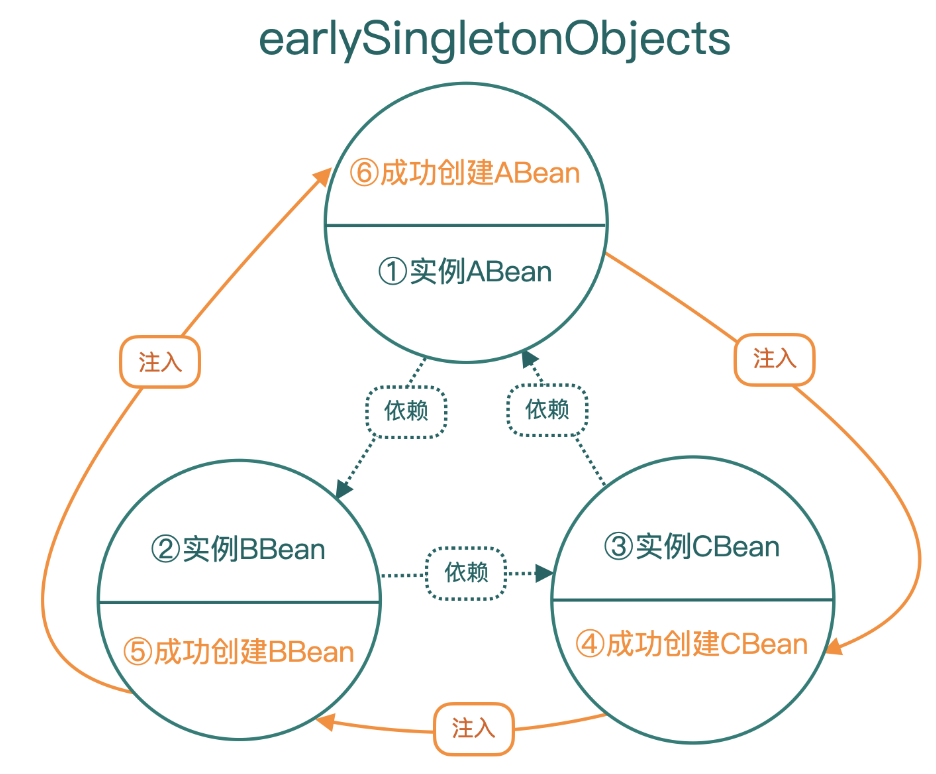

# 【miniSpring】IOC

## 1 概念

IOC，控制反转。**控制** 指的是 **对 JAVA 对象创建的控制权**，**反转** 指的是 **将 JAVA 对象创建的控制权从程序员手中（`new`）反转到 IOC 容器（反射 `newInstance`）手中**。

**为什么需要控制反转？控制反转有什么作用？**

- 因为容器框架并不知道未来业务中需要注入哪个 Bean, 于是通过配置文件等方式告诉容器, 容器使用反射技术管理 Bean 的创建, 属性注入, 生命周期等
- 让程序员无需在管理对象上花费精力

## 2 实现

### 2.1 原始 IOC 实现

一个 IOC 容器需要的部件：

- 一个部件对应 Bean 内存的映像
  - 意思就是，对一个 Bean 的定义内容，通过一个内存中的类来进行读取保存
  - 相当于把磁盘文件，读取到内存中

- 一个 XML reader 负责从外部 XML 文件中读取 Bean 的声明
- 一个反射部件负责加载 Bean Class 并创建这个实例
- 一个 Map 负责保存 Bean 的实例
- 提供一个 `getBean()` 方法供外部使用



`ClassPathXmlApplicationContext` 的功能：

- 读取、解析 xml 文件中的内容
- 加载解析的内容，创建 `BeanDefinition` ，将 `Bean` 的配置信息放到内存
- 根据 `BeanDefinition` ，通过反射实例化 `Bean`，并将



通过构建，我们在业务程序中不需要再手动  `new` 一个业务类，只要把它交由框架容器去管理就可以获取我们所需的对象。另外还支持了 `Resource` 和 `BeanFactory`，**用 `Resource` 定义 `Bean` 的配置数据来源，让 `BeanFactory` 负责 `Bean` 的容器化管理** 。


### 2.2 扩展 IOC 容器

我们对上述 IOC 容器进行扩展，主要包括：

- 增加单例 Bean 的接口定义，把所有的 Bean 默认设置为单例模式
- 预留事件监听的接口，方便后续进一步解耦代码
- 扩展 BeanDefinition，增加属性

#### 管理单例Bean的容器

`SingletonBeanRegistry` 中定义了管理单例 Bean 的接口，包括 Bean 的注册、获取、判断是否存在等。

`DefaultSingletonBeanRegistry` 是 `SingletonBeanRegistry` 的具体实现。

`SimpleBeanFactory` 为了实现单例，直接继承 `DefaultSingletonBeanRegistry` ，调用父类方法和成员变量 `ConcurrentHashMap`。


#### 增加事件监听

构建好单例 Bean 之后，**为了监控容器的启动状态**，我们要增加事件监听。

#### 注入

Spring 中有三种属性注入的方式，分别是 **Field 注入、Setter 注入和构造器（Constructor）注入**。

这里先实现 Setter 注入：

```xml
<?xml version="1.0" encoding="UTF-8" ?>
<beans>
    <bean id = "aservice" class = "com.minis.test.AServiceImpl">
        <property type="String" name="property1" value="Hello World!"/>
    </bean>
</beans>
```

在 Setter 注入中，我们在 标签 `<bean>` 下引入了 `<property>` 标签，它又包含了 type、name 和 value，分别对应 **属性类型、属性名称以及赋值**。你可以看一下这个 Bean 的代码。

```java
public class AServiceImpl implements AService {

    private String property1;

    /**
     * setter 注入 property1
     * @param property1
     */
    public void setProperty1(String property1) {
        this.property1 = property1;
    }
}
```

然后实现构造器注入：

```xml
<beans>
    <bean id="aservice" class="com.minis.test.AServiceImpl">
      <constructor-arg type="String" name="name" value="abc"/>
      <constructor-arg type="int" name="level" value="3"/>
    </bean>
</beans>
```

可以看到，与 Setter 注入类似，我们只是把 `<property>` 标签换成了 `constructor-arg` 标签。

```java
public class AServiceImpl {
  
  private String name;
  private int level;

  public AServiceImpl(String name, int level) {
    this.name = name;
    this.level = level;
  }
}
```

由上述两种方式可以看出，**注入操作的本质，就是给 Bean 的各个属性进行赋值** 。具体方式取决于实际情况，哪一种更便捷就可以选择哪一种。如果采用构造器注入的方式满足不了对域的赋值，也可以将构造器注入和 Setter 注入搭配使用。

我们要配置对应的属性类，分别命名为 ArgumentValue 和 PropertyValue。

这里的属性类的成员变量与 xml 中定义的要对应。

```java
public class ArgumentValue {
    private Object value;
    private String type;
    private String name;
    public ArgumentValue(Object value, String type) {
        this.value = value;
        this.type = type;
    }
    public ArgumentValue(Object value, String type, String name) {
        this.value = value;
        this.type = type;
        this.name = name;
    }
    //省略getter和setter
}
```

以及：

```java
public class PropertyValue {
    private final String name;
    private final Object value;
    public PropertyValue(String name, Object value) {
        this.name = name;
        this.value = value;
    }
    //省略getter
}
```

我们看 Value 这个词，后面不带“s”就表示他只是针对的某一个属性或者某一个参数，但一个 Bean 里面有很多属性、很多参数，所以我们就 **需要一个带“s”的集合类**。

我们参考 Spring 的方法，提供了 ArgumentValues 和 PropertyValues 两个类，封装、 增加、获取、判断等操作方法，简化调用。**既给外面提供单个的参数 / 属性的对象，也提供集合对象**。

#### 扩展 BeanDefinition

我们先给 BeanDefinition 和 BeanFactory 增加新的接口，新增接口基本上是适配 BeanDefinition 新增属性的。

```java
public class BeanDefinition {
    String SCOPE_SINGLETON = "singleton";
    String SCOPE_PROTOTYPE = "prototype";
    private boolean lazyInit = false;
    private String[] dependsOn;
    private ArgumentValues constructorArgumentValues;
    private PropertyValues propertyValues;
    private String initMethodName;
    private volatile Object beanClass;
    private String id;
    private String className;
    private String scope = SCOPE_SINGLETON;
    public BeanDefinition(String id, String className) {
        this.id = id;
        this.className = className;
    }
    //省略getter和setter
}
```

之前我们只有 id 和 className 属性，现在增加了 **scope** 属性，表示 bean 是 **单例模式还是原型模式**，还增加了 **lazyInit** 属性，表示 Bean 要不要在 **加载的时候初始化**，以及初始化方法 **initMethodName** 的声明，当一个 Bean 构造好并实例化之后是否要让框架调用初始化方法。还有 **dependsOn** 属性 **记录 Bean 之间的依赖关系**，最后还有构造器参数和 property 列表。


### 2.3 继续完善依赖注入

我们已经完成了 Setter 注入和构造器参数注入，进一步来看看如何完善。

在 xml 文件中进行配置：

```xml
<?xml version="1.0" encoding="UTF-8" ?>
<beans>
    <bean id="aservice" class="com.minis.test.AServiceImpl">
        <constructor-arg type="String" name="name" value="abc"/>
        <constructor-arg type="int" name="level" value="3"/>
        <property type="String" name="property1" value="Someone says"/>
        <property type="String" name="property2" value="Hello World!"/>
    </bean>
</beans>
```

配置通过 `type`、`name`、`value` 来定位一个构造器参数，或者是一个属性。

我们先来完善 xml 读取配置这一个步骤，这步就是 **从磁盘中的配置文件中，将配置读取到内存中**，需要编写的类是 `XmlBeanDefinitionReader`。

```java
public void loadBeanDefinitions(Resource resource) {
        while (resource.hasNext()) {
            Element element = (Element) resource.next();
            String beanID = element.attributeValue("id");
            String beanClassName = element.attributeValue("class");
            BeanDefinition beanDefinition = new BeanDefinition(beanID, beanClassName);
          
            //处理属性
            List<Element> propertyElements = element.elements("property");
            PropertyValues PVS = new PropertyValues();
            for (Element e : propertyElements) {
                String pType = e.attributeValue("type");
                String pName = e.attributeValue("name");
                String pValue = e.attributeValue("value");
              	// 读入内存
                PVS.addPropertyValue(new PropertyValue(pType, pName, pValue));
            }
            beanDefinition.setPropertyValues(PVS);
            
            //处理构造器参数
            List<Element> constructorElements = element.elements("constructor-arg");
            ArgumentValues AVS = new ArgumentValues();
            for (Element e : constructorElements) {
                String aType = e.attributeValue("type");
                String aName = e.attributeValue("name");
                String aValue = e.attributeValue("value");
              	// 读入内存
                AVS.addArgumentValue(new ArgumentValue(aType, aName, aValue));
            }
            beanDefinition.setConstructorArgumentValues(AVS);
            this.simpleBeanFactory.registerBeanDefinition(beanID, beanDefinition);
        }
    }
}
```

ok，到这里，我们已经读入了内存，接下来要处理的是 **如何作为 bean 的属性进行注入呢？**

这就需要我们在 **创建 bean 的时候做相应的处理，给属性赋值即可**。

#### 构造器注入

具体步骤：

- 从 `beanDefinition` 中读取 `bean` 的类型

  ```java
  Class<?> clz = Class.forName(beanDefinition.getClassName());
  ```

- 从 `beanDefinition` 中读取 `bean` 的构造器参数

  ```java
  ArgumentValues argumentValues = beanDefinition.getConstructorArgumentValues();
  ```

- 循环 `argumentValues`，因为这里面存的 `value` 对象都是 `Object` 类型，因此需要根据 `type` 进行对应类型转化

  ```java
  Class<?>[] paramTypes = new Class<?>[argumentValues.getArgumentCount()];
  Object[] paramValues = new Object[argumentValues.getArgumentCount()];
  
  // 对每一个参数，分数据类型分别处理
  for (int i = 0; i < argumentValues.getArgumentCount(); i++) {
    	// 获取一个参数
      ArgumentValue argumentValue = argumentValues.getIndexedArgumentValue(i);
    	// 判断参数类型
      if ("String".equals(argumentValue.getType()) ||
              "java.lang.String".equals(argumentValue.getType())) {
          paramTypes[i] = String.class;
          paramValues[i] = argumentValue.getValue();
      } else if ("Integer".equals(argumentValue.getType()) ||
              "java.lang.Integer".equals(argumentValue.getType())) {
          paramTypes[i] = Integer.class;
          paramValues[i] =
                  Integer.valueOf((String)argumentValue.getValue());
      } else if ("int".equals(argumentValue.getType())) {
          paramTypes[i] = int.class;
          paramValues[i] = Integer.valueOf((String)
                  argumentValue.getValue());
      } else { //默认为string
          paramTypes[i] = String.class;
          paramValues[i] = argumentValue.getValue();
      }
  }
  ```

- 通过 **反射** 获取 `bean` 的对应的构造器，创建 `bean` 实例

  ```java
  // 按照特定构造器创建实例
  con = clz.getConstructor(paramTypes);
  obj = con.newInstance(paramValues);
  ```

#### Setter 注入

具体步骤：

- 从 `beanDefinition` 中读取 `bean` 的属性

  ```java
  PropertyValues propertyValues = beanDefinition.getPropertyValues();
  ```

- 循环 `propertyValues`，因为这里面存的 `value` 对象都是 `Object` 类型，因此需要根据 `type` 进行对应类型转化

  ```java
  for (int i = 0; i < propertyValues.size(); i++) {
      //对每一个属性，分数据类型分别处理
      PropertyValue propertyValue = propertyValues.getPropertyValueList().get(i);
      String pType = propertyValue.getType();
      String pName = propertyValue.getName();
      Object pValue = propertyValue.getValue();
      Class<?>[] paramTypes = new Class<?>[1];
      if ("String".equals(pType) || "java.lang.String".equals(pType))
      {
          paramTypes[0] = String.class;
      } else if ("Integer".equals(pType) ||
              "java.lang.Integer".equals(pType)) {
          paramTypes[0] = Integer.class;
      } else if ("int".equals(pType)) {
          paramTypes[0] = int.class;
      } else { // 默认为string
          paramTypes[0] = String.class;
      }
      Object[] paramValues = new Object[1];
      paramValues[0] = pValue;
  
      //按照setXxxx规范查找setter方法，调用setter方法设置属性
      String methodName = "set" + pName.substring(0, 1).toUpperCase() + pName.substring(1);
      Method method = null;
      // 反射 下一步说
  }
  ```

- 通过 **反射** 获取 `bean` 的对应的 `setXXX()` 方法，执行方法，设置属性值

  ```java
  try {
    			// 通过反射获取对应的 setXXX 方法
        	method = clz.getMethod(methodName, paramTypes);
      } catch (NoSuchMethodException e) {
          throw new RuntimeException(e);
      } catch (SecurityException e) {
          throw new RuntimeException(e);
      }
      try {
        	// 方法执行
          method.invoke(obj, paramValues);
      } catch (InvocationTargetException e) {
          throw new RuntimeException(e);
      } catch (IllegalAccessException e) {
          throw new RuntimeException(e);
      }	
  }
  ```

  >可以看到 **反射技术是 IoC 容器赖以工作的基础**。

到这里，我们就完成了对 XML 配置的解析，实现了 Spring 中 Bean 的构造器注入与 setter 注入方式。回到我们开头的问题：配置文件中的属性设置是如何生效的？到这里我们就有答案了，**就是通过反射给 Bean 里面的属性赋值，就意味着配置文件生效了**。



#### Bean 之间的依赖问题

即，**注入的属性值本身就是一个对象**，怎么处理？

`Spring` 做了一个很巧妙的事情，它在标签里增加了 `ref 属性（引用）`，这个属性就记录了需要引用的另外一个 Bean。

```xml
<?xml version="1.0" encoding="UTF-8" ?>
<beans>
    <bean id="basebaseservice" class="com.minis.test.BaseBaseService">
        <property type="com.minis.test.AServiceImpl" name="as" ref="aservice" />
    </bean>
    <bean id="aservice" class="com.minis.test.AServiceImpl">
        <constructor-arg type="String" name="name" value="abc"/>
        <constructor-arg type="int" name="level" value="3"/>
        <property type="String" name="property1" value="Someone says"/>
        <property type="String" name="property2" value="Hello World!"/>
        <property type="com.minis.test.BaseService" name="ref1" ref="baseservice"/>
    </bean>
    <bean id="baseservice" class="com.minis.test.BaseService">
        <property type="com.minis.test.BaseBaseService" name="bbs" ref="basebaseservice" />
    </bean>
</beans>
```

既然添加了 `ref` 属性，接下来我们很自然地会想到，要解析这个属性。下面我们就来解析一下 `ref`，看看 Spring 是如何将配置的 Bean 注入到另外一个 Bean 中的。

在 `PropertyValue.java` 中添加 `isRef` 字段，它 **可以判断属性是 引用类型 还是 普通的值类型**

```java
public class PropertyValue {
    private final String type;
    private final String name;
    private final Object value;
    private final boolean isRef;
    public PropertyValue(String type, String name, Object value, boolean isRef) {
        this.type = type;
        this.name = name;
        this.value = value;
        this.isRef = isRef;
}
```

接下来我们看看如何解析 ref 属性，我们还是在 `XmlBeanDefinitionReader` 类中来处理。

```java
public void loadBeanDefinitions(Resource resource) {
    while (resource.hasNext()) {
        Element element = (Element) resource.next();
        String beanID = element.attributeValue("id");
        String beanClassName = element.attributeValue("class");
        // String -> Object 的过程
        BeanDefinition beanDefinition = new BeanDefinition(beanID, beanClassName);

        // 处理构造器参数
        List<Element> constructorElements = element.elements("constructor-arg");
        ArgumentValues AVS = new ArgumentValues();
        for (Element e : constructorElements) {
            String pType = e.attributeValue("type");
            String pName = e.attributeValue("name");
            String pValue = e.attributeValue("value");
            // 注入的配置读入内存
            AVS.addArgumentValue(new ArgumentValue(pType, pName, pValue));
        }
        beanDefinition.setConstructorArgumentValues(AVS);

        // 处理属性
        List<Element> propertyElements = element.elements("property");
        PropertyValues PVS = new PropertyValues();
        List<String> refs = new ArrayList<>();
        for (Element e : propertyElements) {
            String pType = e.attributeValue("type");
            String pName = e.attributeValue("name");
            String pValue = e.attributeValue("value");
          	// 获取 ref 的参数
            String pRef = e.attributeValue("ref");
            String pV = "";
            boolean isRef = false;
            if (pValue != null && !pValue.equals("")) {
                isRef = false;
                pV = pValue;
            } else if (pRef != null && !pRef.equals("")) {
              	// 如果 pRef 不为空，则设置 isRef 为 true
                isRef = true;
                pV = pRef;
                refs.add(pRef);
            }
            // 注入的配置读入内存
            PVS.addPropertyValue(new PropertyValue(pType, pName, pV, isRef));
        }
      	beanDefinition.setPropertyValues(PVS);
        String[] refArray = refs.toArray(new String[0]);
        beanDefinition.setDependsOn(refArray);
      	
        // 使用 beanFactory 提供的抽象方法注册
        this.simpleBeanFactory.registerBeanDefinition(beanDefinition);
    }
}
```

由上述代码可以看出，程序解析 `<property>` 标签后，获取了 `ref` 的参数，同时有针对性地设置了 `isRef` 的值，把它添加到了 `PropertyValues` 内，最后程序调用 `setDependsOn` 方法，它记录了某一个 `Bean` 引用的其他 `Bean`。这样，我们引用 `ref` 的配置就定义好了。

然后，我们改造一下以前的 `createBean()` 方法，抽取出一个单独处理属性的方法。

```java
/**
 * 解耦，专门处理属性
 * @param bd
 * @param clz
 * @param obj
 */
private void handleProperties(BeanDefinition bd, Class<?> clz, Object obj) {
    // handle properties
    System.out.println("处理 Bean 的属性注入 : " + bd.getId());
    // 获取 BeanDefinition 中的所有定义的属性
    PropertyValues propertyValues = bd.getPropertyValues();

    if (!propertyValues.isEmpty()) {
        // 遍历处理每个属性
        for (int i=0; i<propertyValues.size(); i++) {
            // 获取每个属性的基本信息，包括名称、类型、值 和 是否是引用
            PropertyValue propertyValue = propertyValues.getPropertyValueList().get(i);
            String pName = propertyValue.getName();
            String pType = propertyValue.getType();
            Object pValue = propertyValue.getValue();
            boolean isRef = propertyValue.getIsRef();

            // 参数的 类型数组 和 值数组
            Class<?>[] paramTypes = new Class<?>[1];
            Object[] paramValues =   new Object[1];

            // 如果当前该属性不是引用
            if (!isRef) {
                if ("String".equals(pType) || "java.lang.String".equals(pType)) {
                    paramTypes[0] = String.class;
                }
                else if ("Integer".equals(pType) || "java.lang.Integer".equals(pType)) {
                    paramTypes[0] = Integer.class;
                }
                else if ("int".equals(pType)) {
                    paramTypes[0] = int.class;
                }
                else {
                    paramTypes[0] = String.class;
                }

                paramValues[0] = pValue;
            }
            // 如果当前该属性是一个引用，依赖其他 bean
            else {
                try {
                    // 获取 被依赖（引用） bean 的类型
                    paramTypes[0] = Class.forName(pType);
                } catch (ClassNotFoundException e) {
                    e.printStackTrace();
                }
                try {
                    // getBean 获取 bean
                    paramValues[0] = getBean((String)pValue);
                } catch (BeansException e) {
                    e.printStackTrace();
                }
            }

            // 获取 set 方法名称
            String methodName = "set" + pName.substring(0,1).toUpperCase() + pName.substring(1);
            Method method = null;
            try {
                // 反射
                method = clz.getMethod(methodName, paramTypes);
            } catch (NoSuchMethodException e) {
                e.printStackTrace();
            } catch (SecurityException e) {
                e.printStackTrace();
            }
            try {
                // 反射
                method.invoke(obj, paramValues);
            } catch (IllegalAccessException e) {
                e.printStackTrace();
            } catch (IllegalArgumentException e) {
                e.printStackTrace();
            } catch (InvocationTargetException e) {
                e.printStackTrace();
            }
        }
    }
}
```

对 `ref` 所指向的另一个 `Bean` 再次调用 `getBean()` 方法，这个方法会获取到另一个 `Bean` 实例，这样就实现了另一个 `Bean` 的注入。

这样一来，**如果有多级引用，就会形成一个多级的 `getBean()` 调用链**。由于在调用 `getBean()` 的时候会判断容器中是否包含了 `bean instance`，没有的话会立即创建，所以 `XML` 配置文件中声明 `Bean` 的先后次序是任意的。

#### 循环依赖问题

这又引出了另一个问题，在某个 `Bean` 需要注入另一个 `Bean` 的时候，如果那个 `Bean` 还不存在，该怎么办？

Spring 扫描到了 `ABean`，在解析它并设置内部属性时，发现某个属性是另一个 `BBean`，而此时 Spring 内部还不存在 `BBean` 的实例。这就要求 Spring 在创建 `ABean` 的过程中，能够再去创建一个 `BBean`，继续推衍下去，`BBean` 可能又会依赖第三个 `CBean`。事情还可能进一步复杂化，**如果 `CBean` 又反过来依赖 `ABean`，就会形成循环依赖** 。

请你回顾一下创建 `Bean` 的过程。我们根据 `Bean` 的定义配置生成了 `BeanDefinition`，然后根据定义加载 `Bean` 类，再进行实例化，最后在 `Bean` 中注入属性。

从这个过程中可以看出，**在注入属性之前，其实这个 `Bean` 的实例已经生成出来了，只不过此时的实例还不是一个完整的实例，它还有很多属性没有值**，可以说是一个早期的毛胚实例。

而我们现在讨论的 **`Bean` 之间的依赖是在属性注入这一阶段**，因此我们可以在 **实例化与属性注入这两个阶段之间增加一个环节，确保给 `Bean` 注入属性的时候，Spring 内部已经准备好了 `Bean` 的实例**。

Spring 的做法是 **在 `BeanFactory` 中引入一个结构：`earlySingletonObjects`，这里面存放的就是早期的毛胚实例**。创建 `Bean` 实例的时候，不用等到所有步骤完成，而是可以在属性还没有注入之前，就把早期的毛胚实例先保存起来，**供属性注入时使用**。



具体步骤：

1. 先实例化 `ABean`，此时它是早期的不完整毛胚实例，好多属性还没被赋值，**将实例放置到 `earlySingletonObjects` 中备用**。然后给 `ABean` 注入属性，这个时候发现它还要依赖 `BBean` 。
2. 实例化 `BBean`，它也是早期的不完整毛胚实例，我们也将实例放到 `earlySingletonObjects` 中备用。然后再给 `BBean` 注入属性，又发现它依赖 `CBean`。
3. 实例化 `CBean`，此时它仍然是早期的不完整的实例，同样将实例放置到 `earlySingletonObjects` 中备用，然后再给 `CBean` 属性赋值，这个时候又发现它反过来还要依赖 `ABean`。
4. 我们从 `earlySingletonObjects` 结构中找到 `ABean` 的早期毛胚实例，取出来给 `CBean` 注入属性，这意味着这时 `CBean` 所用的 `ABean` 实例是那个早期的毛胚实例。这样就先创建好了 `CBean`。
5. 程序控制流回到第二步，完成 BBean 的属性注入。
6. 程序控制流回到第一步，完成 ABean 的属性注入。至此，所有的 Bean 就都创建完了。

`createBean()` 方法中调用了一个 `doCreateBean(bd) `方法，**专门负责创建早期的毛胚实例**。毛胚实例创建好后会放在 `earlySingletonObjects` 结构中，然后 `createBean()` 方法再调用 `handleProperties()` 补齐这些 `property` 的值。

```java
/**
 * 创建一个 bean 实例，并完成注入
 * @param bd
 * @return
 */
private Object createBean(BeanDefinition bd) {
    Class<?> clz = null;
    Object obj = doCreateBean(bd);

    // 创建完毛坯实例后，丢入 earlySingletonObjects ，以解决循环依赖问题
    this.earlySingletonObjects.put(bd.getId(), obj);
    try {
        clz = Class.forName(bd.getClassName());
    } catch (ClassNotFoundException e) {
        e.printStackTrace();
    }
    // 处理属性，setter 注入
    handleProperties(bd, clz, obj);
    return obj;
}
```

在 `getBean()` 方法中，**首先要判断有没有已经创建好的 bean，有的话直接取出来**，**如果没有就检查 `earlySingletonObjects` 中有没有相应的毛胚 Bean，有的话直接取出来，没有的话就去创建**，并且会根据 Bean 之间的依赖关系把相关的 Bean 全部创建好。

```java
/**
 * 获取 bean
 * @param beanName
 * @return
 * @throws BeansException
 */
public Object getBean(String beanName) throws BeansException {
  	
    // 尝试直接获取
    Object singleton = this.getSingleton(beanName);

    if (singleton == null) {

        // 尝试从毛坯实例中获取
        singleton = this.earlySingletonObjects.get(beanName);
        if (singleton == null) {
            System.out.println("get bean null -------------- " + beanName);
            BeanDefinition bd = beanDefinitionMap.get(beanName);
            singleton = createBean(bd);
            this.registerBean(beanName, singleton);

            //beanpostprocessor
            //step 1 : postProcessBeforeInitialization
            //step 2 : afterPropertiesSet
            //step 3 : init-method
            //step 4 : postProcessAfterInitialization。
        }

    }
    if (singleton == null) {
        throw new BeansException("bean is null.");
    }
    return singleton;
}
```

很多资料把这个过程叫做 bean 的“**三级缓存**”，这个术语来自于 Spring 源代码中的程序注释。实际上我们弄清楚了这个 `getBean()` 的过程后就会知道这段注释并不是很恰当。只不过这是 Spring 发明人自己写下的注释，大家也都这么称呼而已。

#### 包装方法 refresh()

在 Spring 体系中，Bean 是结合在一起同时创建完毕的。为了减少它内部的复杂性，Spring 对外提供了一个很重要的包装方法：`refresh()` 。具体的包装方法也很简单，就是 **对所有的 Bean 调用了一次 `getBean()`，利用 `getBean()` 方法中的 `createBean()` 创建 Bean 实例，就可以只用一个方法把容器中所有的 Bean 的实例创建出来了**。

```java
/**
 * 创建所有 bean 实例
 */
public void refresh() {
    for (String beanName : beanDefinitionNames) {
        try {
            getBean(beanName);
        } catch (BeansException e) {
            e.printStackTrace();
        }
    }
}
```

然后我们改造 `ClassPathXmlApplicationContext`，配合我们上一步增加的 `refresh()` 方法使用。

```java
/**
 * context 负责整合容器的启动过程，读外部配置，解析 Bean 定义，创建 BeanFactory
 * @param fileName
 */
public ClassPathXmlApplicationContext(String fileName) {
    this(fileName, false);
}

/**
 * 构造方法
 * @param fileName
 * @param isRefresh 是否要通过 refresh 激活整个 IOC 容器
 */
public ClassPathXmlApplicationContext(String fileName, boolean isRefresh){
    Resource res = new ClassPathXmlResource(fileName);
    SimpleBeanFactory bf = new SimpleBeanFactory();
    XmlBeanDefinitionReader reader = new XmlBeanDefinitionReader(bf);
    reader.loadBeanDefinitions(res);
    this.beanFactory = bf;

    if (isRefresh) {
        this.beanFactory.refresh();
    }
}
```


